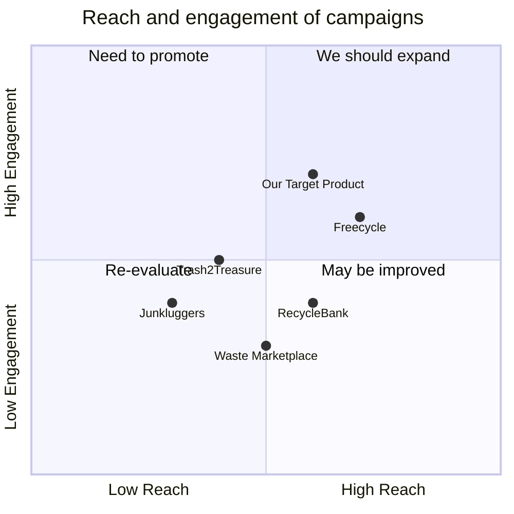

## Original Requirements
The boss has tasked us with creating a platform that efficiently connects recyclable trash producers with users.

## Product Goals
```python
[
    "Create a user-friendly platform for connecting recyclable trash producers and users",
    "Ensure efficient communication and transaction between producers and users",
    "Promote recycling and environmental sustainability"
]
```

## User Stories
```python
[
    "As a trash producer, I want to list my recyclable trash so that users can easily find and purchase them",
    "As a user, I want to search for specific types of recyclable trash so that I can find what I need quickly",
    "As a user, I want to communicate with the trash producers so that I can negotiate prices and pickup times",
    "As a trash producer, I want to receive notifications when a user is interested in my listed items so that I can respond promptly",
    "As a user, I want to rate and review trash producers so that others can make informed decisions"
]
```

## Competitive Analysis
```python
[
    "Trash2Treasure: A similar platform but lacks efficient communication tools",
    "RecycleBank: Focuses more on recycling education rather than connecting producers and users",
    "Freecycle: A platform for giving away items for free, not specifically for recyclable trash",
    "Waste Marketplace: A B2B platform for waste materials, not user-friendly for individual users",
    "Junkluggers: A junk removal service, not a platform for connecting producers and users"
]
```

## Competitive Quadrant Chart


## Requirement Analysis
The product should be a web-based platform that allows recyclable trash producers to list their items and users to search, communicate, and transact with the producers. The platform should be user-friendly and promote efficient communication and transactions.

## Requirement Pool
```python
[
    ("User registration and login system", "P0"),
    ("Listing and search functionality for recyclable trash", "P0"),
    ("Communication tools for users and producers", "P0"),
    ("Notification system for producers when users show interest", "P1"),
    ("Rating and review system for producers", "P1")
]
```

## UI Design draft
The platform should have a clean, minimalist design with intuitive navigation. The homepage should display a search bar for users to find recyclable trash and a button for producers to list their items. Each listed item should display relevant information such as type of trash, quantity, price, and producer's rating. Users should be able to click on an item to communicate with the producer and arrange for pickup.

## Anything UNCLEAR
There are no unclear points.