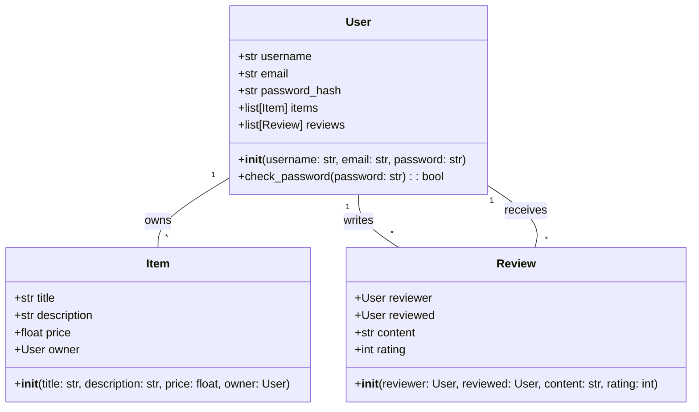
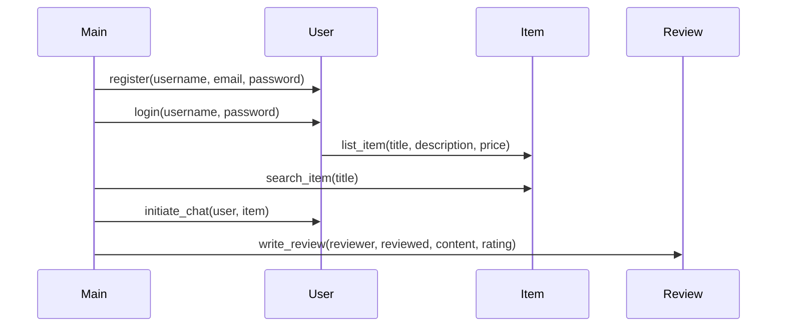

## Implementation approach
We will use the Flask framework for building the web application due to its simplicity and flexibility. For the database, we will use SQLAlchemy which is a Python SQL toolkit and Object-Relational Mapping (ORM) system. For user authentication, we will use Flask-Login. For real-time communication, we will use Flask-SocketIO. For form validation and submission, we will use Flask-WTF. For notifications, we will use Flask-Mail.

## Python package name
```python
"recycle_marketplace"
```

## File list
```python
[
    "main.py",
    "config.py",
    "models.py",
    "forms.py",
    "views.py",
    "static/css/main.css",
    "templates/index.html",
    "templates/login.html",
    "templates/register.html",
    "templates/listing.html",
    "templates/search.html",
    "templates/chat.html"
]
```

## Data structures and interface definitions


## Program call flow


## Anything UNCLEAR
The requirement is clear to me.